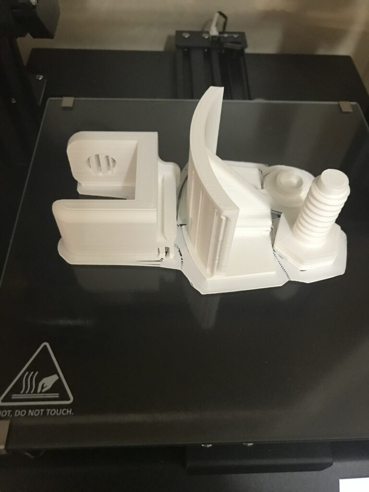
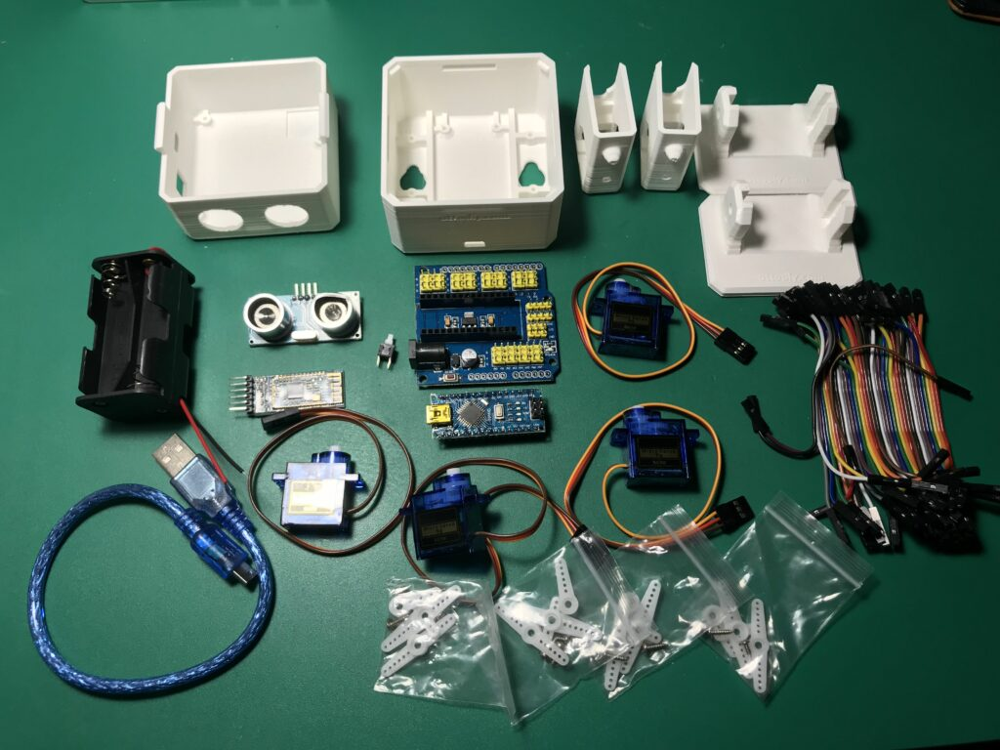

Pues si! Al final hemos caido y tenemos impresora 3D.

En concreto una Anet ET4 Pro, que es algo así como la impresora marca "Hacendado" del momento. La última vez que vi una de estas de cerca funcionando fue en una actividad del grupo de usuarios MAC, un trasto grande, feo y lleno de varillas, motores y cables por todas partes.

Estaban en lo que denominaban las "**clone Wars**" o [máquina auto-replicables](https://www.reprap.org/wiki/RepRap/es) , esto es, con una impresora podías crear las piezas necesarias para otras impresoras.

Por suerte la impresora que he comprado tiene poco que ver, solo 4 tornillos para apretar, tensar dos cosas aquí, conectar unos cables allí y listo, se puede empezar a configurar. No tengo ya edad para andar ajustando y ajustado, yo quiero imprimir, la investigación ya la dejo para otros.

Eso si, de lo que no te libras nunca es de la nivelación de la cama, será la siguinte entrada de esta categoría, es tema aparte y una vez que lo consigues rezas para que dure mucho tiempo el ajuste. Este modelo de impresora trae teóricamente autonivelación pero es muy relativo, al final el método del papel rozando la boquilla es lo único que vale, eso y la laca Nelly extrafuerte.

Al principio los problemas típicos, el filamento que se despega de la cama a mitad de impresión, la bobina de filamento que no gira bien y los parámetros del software para laminar que no terminan de cuadrar, la velocidad, calidad y duración de la tarea de impresión son parámetros que cuestan mucho dominar.

Algunas piezas grandes ya van saliendo

Y algunas cosas voy incluso atreviendome a diseñar, cosas sencillas por supuesto, como esto: [https://www.tinkercad.com/things/cxx8aXWnTKH-adaptador-spool-amazon-basic](https://www.tinkercad.com/embed/cxx8aXWnTKH?editbtn=1) que es un adaptador para la bobina de filamento y que haga de unión entre el tubo al que se sujeta en la impresora (20mm) y la bobina que presenta un agujero interior mucho mayor (52mm).

Os anticipo cual es el siguiente proyecto Impresora 3D + Arduino, un OttoDIY que promete horas de diversión

Bienvenidos a la comunidad #Makers3D
