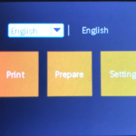
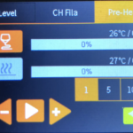
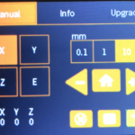
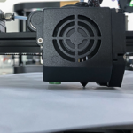
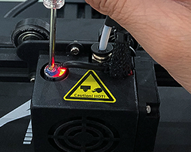
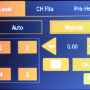
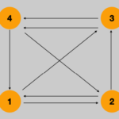

Como os dije en [la primera entrada](/pruebadeconcepto.es/3dp/3d_anetet4pro/) de esta categoría de impresión 3D, aquí os dejo la forma en la que estoy nivelando la cama caliente de mi Anet ET4 Pro.

Antes de esto probé unos cuantos métodos, y también la nivelación automática que incorpora de serie, pero todos ellos con resultados regulares tirando a malos. Con este método consigo calidad uniforme de impresión y que las primeras capas peguen bien al cristal de la cama ayudándome por supuesto de la famosa laca Nelly en su versión extra fuerte.

## Paso 1

Tenemos que precalentar la cama y la boquilla, lógico, los metales calientes tienen la manía de dilatar y si hacemos estos ajustes en frío nos llevaremos la desagradable sorpresa de que no ha servido para nada. Desde el menú principal pulsamos sobre "_**Prepare**_" y dentro del suficiente menú en "**_Pre-Heat_**".

<table style="border-collapse: collapse; border: none; width: 100%;"><tbody><tr style="border: none;"><td style="border: none; width: 50%;"></td><td style="border: none; width: 50%;"></td></tr></tbody></table>

Yo caliento la boquilla a 210º y la cama a 60º, esto último no se si será necesario, no lo he encontrado como tal en ningún otro manual pero la lógica me lleva a pensar que algo de dilatación puede existir también y que la altura el cristal se pueda ver afectada.

## Paso 2

Podemos aprovechar el tiempo que tarda en precalentar todo para este paso. Consiste en soltar las tuercas de los tensores de la cama caliente del todo, hasta que giran sin tener ninguna tensión sobre lo muelles. Yo las quité del todo y aproveché para hacerles una marca con rotulador en un lado, y así luego poder saber cuántas vueltas o medias vuelta he le podido llegar a dar a cada una.

Ahora las vuelvo enroscar y desde el momento en el que noto que tengo la mínima resistencia, esto es, el muelle está actuando, doy 4 o 5 vueltas completas apretado.

Con todo esto lo que conseguimos es dejar la cama con tensión en los muelles que evite que se mueva, y ademas tenemos algo de recorrido tanto para tensar como para destentar y así podamos subir o bajar la cama en la nivelación. De otra manera, si dejamos la cama con los tornillos muy sueltos podríamos nivelar bajando la cama (apretar roscas) pero no podríamos hacer nada para subirla una vez que estas esté completamente destentadas (aflojar roscas).

## Paso 3

Volvemos al menú principal, una vez precalentada cama y boquilla y ajustada la altura inicial.

Desde el menú principal entramos en "_**Settings**_" y pulsamos sobre el botón home.

Se empieza a mover el cabezal hasta localizar el home y empieza a bajar, tenemos que estar atentos para detenerlo cuando está bajando y se encuentra a unos 2 cms de altura respeto a la cama, en ese momento pulsamos el botón stop y se queda detenido.

## Paso 4

Ahora toca coger un papel (un folio típico A4 de 80 gramos servirá, no tiene que ser nuevo pero que no esté arrugado) y vamos a aproximar nuestro cabezal lo máximo posible al papel.

Pulsamos sobre el eje Z, y luego según la altura en los valores 0,1 ( 0,1 mm ) , 1 (1 mm) ó 10 (10 mm), atención por que podemos partir el cristal si bajamos de golpe. Tenemos que bajar hasta que el papel se quede casi pillado entre la boquilla y la cama, y al moverlo raspe, no tiene que costar mucho moverlo pero si que tiene que haber un poco de rozamiento.

Para continuar retiramos el papel.

## Paso 5

Usando el destornillador plano que nos viene con la impresora vamos a desconectar el sensor de proximidad y a volver a conectarlo

Para esto giramos el destornillador en sentido antihorario hasta que se apague a luz roja (que seguramente tengamos encendida, pero si no es así no pasa nada), y luego muy poco a poco vamos a volver a girar el destornillador en sentido horario hasta que se encienda la luz roja y justo en ese momento dejamos de mover el destornillador.

Antes de seguir al siguiente paso pulsaremos el botón "_**Stop**_"

## Paso 6

Pulsamos sobre "_**Volver**_" y salimos al menú principal, desde aquí iremos a "_**Prepare**_" para entrar en "_**Level**_" y luego en la sección "_**Manual**_".

Pulsaremos sobre las flechas hasta que aparezca en el centro "`0.50`".

## Paso 7

Y ahora viene la parte más pesada y más larga, tenemos que poner nuestro papel de antes e ir repitiendo la operación de aproximación máxima del cristal a la boquilla, utilizando el rozamiento del papel entre ambos como medida.

Ponemos por tanto el papel y pulsamos sobre "_**1**_", el cabezal se mueve a la posición delante izquierda, y con la rueda vamos dando o quitando altura hasta que el papel roce.

Pasamos a posición 2 y repetimos, 3 y repetimos, 4 y repetimos...

Yo repito esta operación 1, 2, 3 y4 al menos un par de veces, y luego hago lo mismo pero cruzado, esto es, empiezo en 1, cruzo en diagonal a 3, izquierda a 4, diagonal a 2, y vuelta a 1.

Esto hasta que te canses, o veas que por mucho que muevas el cabezal y la cama esta última está siempre a la misma distancia y el roce del papel es el mismo.

## Paso 8

Pulsamos sobre "**_Manual_**" y el cabezal vuelve a nuestro home, en ese momento volvemos a usar las flechas hasta dejar el número como estaba "`0.00`".

Sólo nos resta pulsar sobre "_**Stop**_" y luego el botón "_**Volver**_" para regresar al menú principal con la cama perfectamente nivelada.

Espero que os sirva y que no desesperéis mucho como yo al principio con esto, cuesta cogerle el truco pero una vez nivelada no se suele mover
