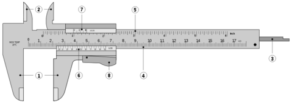
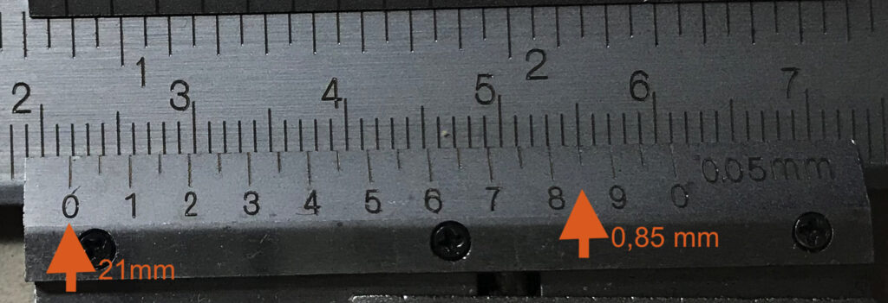

Desde que [tenemos la impresora 3D](/pruebadeconcepto.es/3dp/3d_anetet4pro) le estoy volviendo a dar un buen uso a esta herramienta, que de otra manera estaba olvidada en el fondo de un cajón para medir tan solo de manera ocasional el grosor de un tornillo o poco más.

Fue durante mi etapa de Bachillerato cuando en segundo curso nos enseñaron a usarlos, recuerdo que era en una asignatura llamada "Técnicas de campo", que no tenía que ver con el campo al aire libre, salvo por un trabajo de botánica... Hacíamos bastantes cosas en laboratorio, extraer el alcohol del vino calentándolo y usando un tubo de enfriamiento, reacciones exotérmicas con peróxido de hidrógeno y yoduro potásico (agua oxigenada y Betadine), que hacían un montón de espuma. Cosas que a día de hoy serían impensables... las nuevas generaciones que son tan delicadas...

Un día nos enseñaron a usar el calibre, era algo que ya había visto en casa, pero ni idea de cómo funcionaban ni la asombrosa precisión que algo sin pilas podía llegar a tener, así como su versatilidad.

El calibre tiene una precisión de 1/50mm, dependiendo de la graduación su Nonio (ahora os explico que es).

Sobre este gráfico (fuente wikipedia, que es el dibujo más claro que he encontrado) os indico sus componentes:

**1.** Palpadores de exteriores  (nos permite tomar medidas exteriores al objeto) **2.** Palpadores de interiores (nos permite tomar medidas interiores del objeto) **3.** Sonda de profundidad (nos permite tomar medida de la profundidad) **4** y **5**. Regla graduada (en mm y en pulgadas) **6** y **7**. Nonio o vernier (en mm y en pulgadas) **8**. Botón de desplazamiento (si no presionamos no se moverá y nos permite "bloquear" la lectura)

Por lo general encontraremos calibres de **apreciación** 0.05mm y 0.02mm, cualquier de los dos para estas finalidades nos vendrán bien. Con uno de 0.02mm encontraremos que las franjas del Nonio no son exactas de 1mm, si no que son de 0.98mm, por tanto podermos tomar medidas de 0.02 mm en 0.02mm

Los pasos para usar un calibre son sencillos, tomamos la medida según mejor nos convenga, palpadores externos, internor o profundida y luego miramos las marcas de Nonio.

Por ejemplo, dada esta medida:

Buscamos el 0, veos que está entre las marcas de la regla fija, entre la marca de 21 y 22 mm, por tanto tendremos una medida de **21mm** más algo más. Ahora miramos las marcas del Nonio y buscamos la que mejor coincide con las de la regla (aquí es donde encontraremos diferencias entre un calibre de 0.02 y otro de 0.05 pues en el primero tendremos muchas más marcas), en este caso es la de 8,5, por tanto serán **0.85 mm**. Por tanto la medida que hemos tomado es de **21.85mm**

Para saber si tenemos una medida "redonda" en mm, por ejemplo, 21mm, debemos ver en las marcas del Nonio que la marca del 0 y la marca del 10 ambas coinciden en sus marcas de la regla fija.

Y esto es todo, un instrumento sencillo, sin pilas, con mucha precisión que os acompañará toda la vida, así que comprad uno de calidad (la marca japonesa Mitutoyo hace unos estupendos), que con la impresora 3D os aseguro que lo vais a usar y mucho!!.
