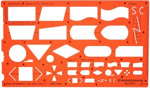
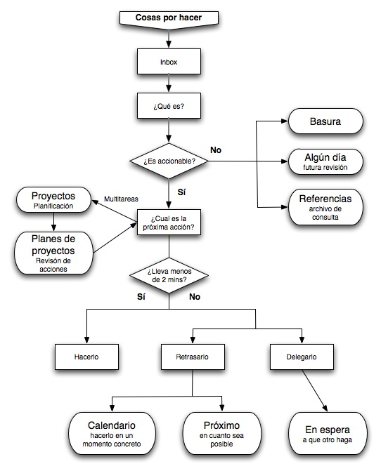
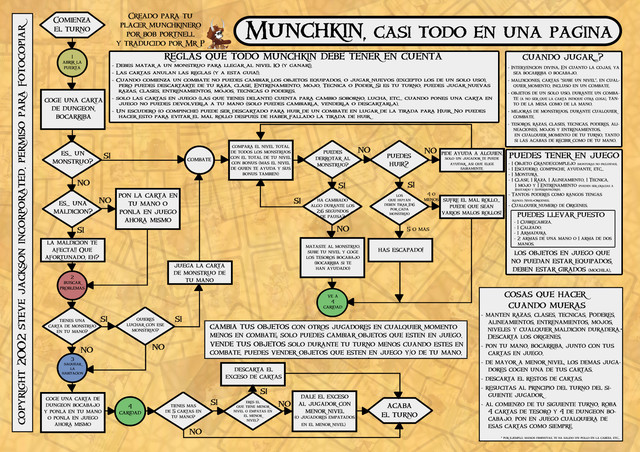

En la reciente limpieza de trastos y la pila de papeles del escritorio apareció esta regla:

Es una Standardgraph 8385 que se empleaba para pintar los diagramas de flujo de una manera un poco más limpia que haciendo los elementos a mano, muy útil para los que tenemos dos manos izquierdas.

Recuerdo haberla usado sólo para algún trabajo donde ilustrar el procesamiento que habíamos realizado, y al poco tiempo empezaron a salir aplicaciones que te hacían el diagrama escribiendo este en una especide de pseudo-código.

Trato de hacer memoria de para que valía cada uno de los símbolos y me cuesta acordarme, salvo por el rombo, que ese tengo asociado a la decisión siempre. Buscando en la normativa ISO (https://webstore.ansi.org/Standards/ISO/ISO58071985) encontramos las siguientes formas:

| Forma ANSI/ISO | Nombre | Descripción |
| --- | --- | --- |
|  | Flujo | La línea sale desde un símbolo hasta otro y en caso de que el flujo no sea de arriba hacia abajo o de izquierda a derecha deberemos indicar el sentido del mismo con la punta de flecha. |
|  | Entrada | Representa una entrada de información, un fichero, entrada por teclado, etc. |
|  | Salida | Representa la salida de información, sea en un volcado a papel por impresora, pantalla, etc. |
|  | Terminador | Represtenta el inicio o el fin de nuestro programa o proceso. |
|  | Proceso | Es el conjunto de operaciones a realizar. |
|  | Decisión | Determina el camino que seguirá el flujo mediante simples preguntas tipo SI/NO o condiciones sencillas. |
|  | Subproceso | Al igual que programamos y generamos código en subrutinas con estos subproceso podemos emplear procesos ya detallados en otros diagramas y ahorrar trabajo. |

Parece mentira pero todo esto a día de hoy sigue estando presente (no tanto el hacerlo con una regla de hace 35 años como el diseño en si) y sigue teniendo todo el sentido. Cuando a alguien le enseñas un diagrama con estos simples símbolos sabe lo que tiene que hacer.

Algunos ejemplos, este proceso para la productividad GTP ( [Getting Things Done](https://gettingthingsdone.com/) ) que no es más que la forma que se pueden mover nuestras tareas desde múltiples entradas hasta la finalización de la tarea (sea por realizacion, por eliminación, etc.)

Incluso en otros ámbitos, como son los juegos de mesa, el uso de diagamas de flujo está muy extendido y nos ayuda a saber el camino que debemos seguir (flujo) a lo largo del juego según se desarrollen los acontecimientos en el mismo (decisiones). Como ejemplo aquí el diagrama para jugar a [Munchkin](http://www.edgeent.com/juegos/coleccion/munchkin) que sin tener que explicar a nadie la norma ISO al respecto de estos diagramas será capaz de seguirlo sin problemas.

El uso de las formas que hace quizás no sea el más ortodoxo (que dada la finalidad y desarrollo de este divertido juego le viene al pelo) pero que le pone un punto de sentido al "flujo" de cada tirada en la partida no quedan dudas.
