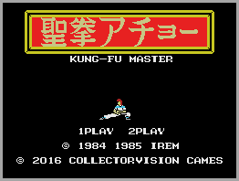

Anda que no ha llovido... y eso que Monkey Island no fue ni mucho menos el primer contacto que tuve con un ordenador, pero a buen seguro que fue el que más me marcó.

No tuve la suerte de tener un ZX, ni siquiera un Amstrad, en esto fui unos meses con retraso respecto a los vecinos, un año todo lo más y entré directamente en el mundillo de las computadoras con un MSX, y su correspondiente unidad de cinta Computone (y ese destornillador para ajustar el azimut!!!)

Fui el rey del barrio, con los cartuchos que cargaban al instante, que de horas con el Kung-Fu Master!!.

Luego siguieron equipos más o menos potentes, recuerdo el primer equipo con Intel, un [Bondwell 38](https://classictech.wordpress.com/computer-companies/bondwell-industrial-co-inc-fremont-calif/) de 1986, que tenía un disco duro de nada menos que 20MB, con eso era el rey del barrio.

Hay sonidos y luces que no se olvidan, el arranque de esta máquina, con el disco duro que cogía revoluciones poco a poco y parecía que la turbina de un avión se había colado en el cuarto, y los destellos y estelas de la pantalla de fósforo verde.

Recuerdos que están casi a la misma altura que los sonidos de un modem de 9600 [baudios](https://es.wikipedia.org/wiki/Tasa_de_baudios) (¿baudios?, los jóvenes que no diferencian un bit de un byte ni saben que eso existe..) y sus luces intermitentes con el cuarto a oscuras, que fueron la mayoría de mis "discotecas" de juventud.

Los chicos de hoy en día, si no tienen equipos que generan miles de millones de triángulos por segundo y texturas reales... pues no les vale nada.

Nunca sabrán la relación de un pollo de goma y una polea, ni disfrutaran de esta [maravilla de banda sonora](https://youtu.be/WjvD3C_nvBk) tan de 8bits.

Tranquilos, nunca es tarde, si quieres disfrutar de esta aventura gráfica y de [otras muchas contemporáneas](https://www.scummvm.org/screenshots/#lec) échale un vistazo a [ScummVM](https://www.scummvm.org) y localiza las Roms.

Disfruta!!
