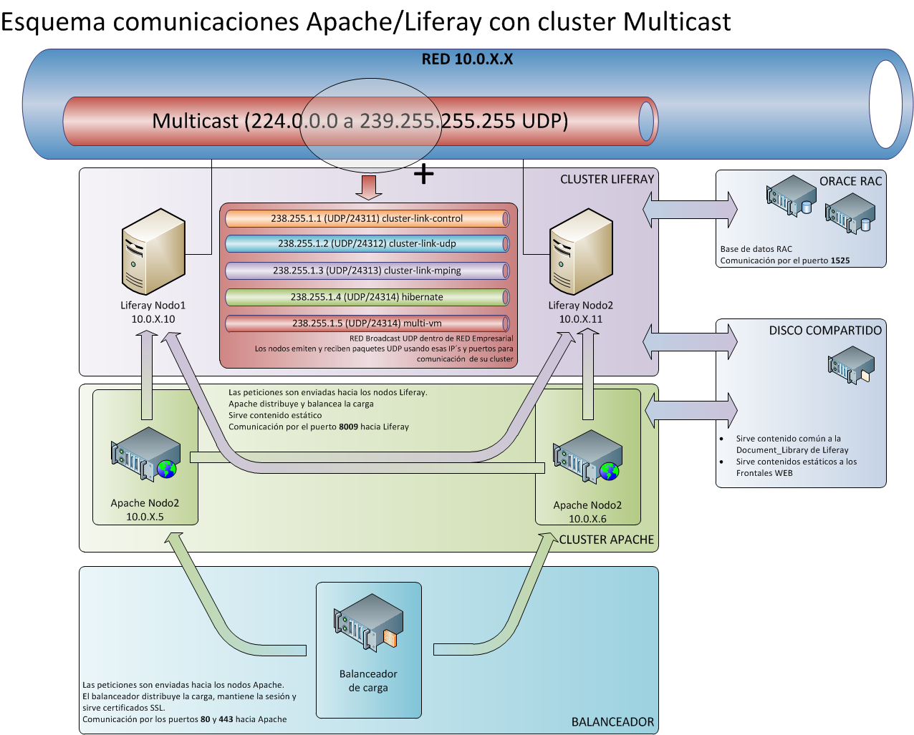
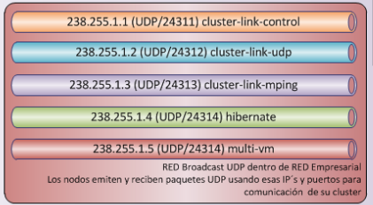

Es habitual tener que **acudir a reuniones** en las que toca **explicar algunos conceptos**, que no siendo complejos **resultan complicados de mostrar**, por lo general el "público" suele ser más bien parte de nuestra entrañable "[población civil](http://pruebadeconcepto.es/mirror-para-todos-los-publicos/)".

A esto hay que unir el hecho de que muchas veces esta reuniones son **en remoto**, en la otra punta del mundo, siguiendo el sol, nos conectamos desde España con Latam **al final de nuestra jornada laboral** cuando estamos ya poco lúcidos y con **pocas o ninguna gana de hacernos entender**.

Algunas veces **me sorprendí a mi mismo** antes de entrar o conectarme a estas charlas dando una respiración profunda y pensando "padentro" _usa palabras cortas... palabras cortas que no te van a entender_.

En una de estas tocó explicar la **comunicación [Multicast](https://es.wikipedia.org/wiki/Multidifusión) que usaba Liferay 6.2** para poder escalar horizontalmente el cluster, como me imaginaba que si decía aquello de _broadcast_ _udp_ o similares **la reunión iba a ser muy larga** hice un pequeño esquema (pequeño al principio... que me llevó un buen rato y es de uno de los que más orgulloso estoy)

Y claro, estas allí compartiendo pantalla, una sala llena de gente más otra sala llena de gente al otro lado del charco, explicas como funciona esto (... palabras cortas ...) y **después de unos incómodos segundos de silencio** alguien pregunta sobre esto en concreto:

¿Pero esto significa que **cada una de esas comunicaciones se emite sobre cada uno de los hilos de mis cables** ethernet??

Y no supe donde esconderme...

 

PS: edito el post y añado... me dio por instalar un plugin de SEO, más que nada por curiosidad, años peleándome con la gente de SEO y su **afán enfermizo** por las reescrituras en lo frontales web, su posicionamiento y sus historias.

Pues bien, me encuentro que al final en esto del SEO **también fui un visionario** como os acabo de comentar, palabras cortas que no te entienden... palabras cortas...

[Prueba de legibilidad Flesch](https://yoa.st/34r): El texto puntúa 53.5 en la prueba, lo que se considera _**bastante difícil de leer**_. [Prueba haciendo frases más cortas para mejorar la legibilidad](https://yoa.st/34s).
