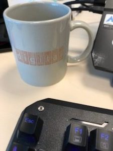

En 1999 estuve en la sede de [Digital Equipment Corporation](https://es.wikipedia.org/wiki/Digital_Equipment_Corporation), recién **adquirida por Compaq y en pleno proceso de desmantelamiento**. Íbamos a hacer unos **bancos de pruebas de nuestro software** en las DEC ES40, uno de los servidores que recuerdo con más cariño, unos buenos trastos, como otros de la familia Tsunami.

Aterrizamos en Bostón después de hacer escala en el JFK y nos dieron un Diskette (1.44) de propaganda con uno de los **famosos kit de conexión a internet gratis**.

En España también los teníamos, alguno se acodará de **los modems**, de **los kits gratis, que no eran tan gratis** y de **la interminable espera para la tarifa plana famosa** que fue otro [atraco a mano armada](https://elpais.com/diario/1999/10/07/sociedad/939247213_850215.html) y un cachondeo en nuestra cara.. siempre en el vagón de cola de las comunicaciones.

Pues bien, **con ese kit de conexión** montamos uno de los equipos de escritorio que nos dejaron, un winproxy, un modem de 28k y una llamada local (que si que era gratuita de verdad, aunque plagada de publicidad) y por esa conexión, que ya os digo que en España serviría para navegar una persona y bastante mal, **conseguimos navegar 6 personas**, conectarnos contra nuestro servidor de correo en España e incluso descargar actualizaciones de código que llegaban como siempre en el último momento.

Una calidad así de conexión con un simple modem no la volví a experimentar hasta que **años más tarde** empezaron a implantarse las **conexiones ADSL**.

Ni siquiera en mi empresa, que por aquel entonces teníamos una **conexión dedicada** con British Telecom y por [Frame Relay](https://es.wikipedia.org/wiki/Frame_Relay) conseguí encontrar aquello con la misma soltura.

Estamos ya tan a**costumbrados a los MBs y MBs de conexión, por encima de la centena, incluso simétricos** (que tiempos aquellos, X de bajada e Y de subida...), que **no recordamos** cuando tenías que **esperar ver la carga de una imagen en pantalla línea a línea** de jpg (y cuando casi había cargado pufff se cortaba al descolgar alguien un teléfono en casa!!)

Como recuerdo de aquel viaje a Estados Unidos, hace ya.. madre mía.. 20 años!!! tengo mi taza de "Digital", ha perdido casi todo el color y casi el grabado, pero es indudable que está hecha con espíritu americano, **Made to Last.**

