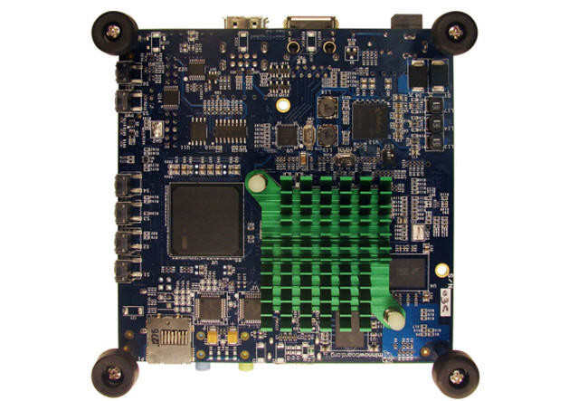
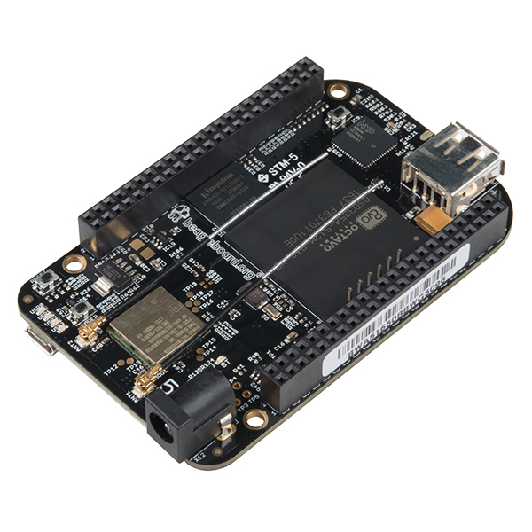
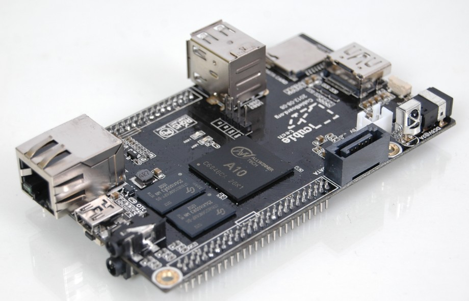
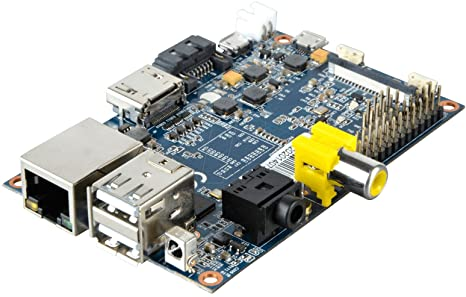

## Alternativas a Rpasberry Pi

Existen claro está, y cada día hay más y mejores.

Hay dos aspectos en los que es difícil competir con la RPI, que son por un lado **el precio**, y por otro lado **la comunidad**, y es que haber colocado en circulación más de 2,5 millones de unidades te deja una comunidad detrás inmensa.

## Empezamos con la lista de competidores.

**MinnowBoard MAX** ([http://www.minnowboard.org/meet-minnowboard-max/](http://www.minnowboard.org/meet-minnowboard-max/)), de las más recientes

Es la respuesta de INTEL a todo este mercado que está perdido frente a los micros ARM.

Incorpora muchas (por no decir que todas) de las peticiones y sueños de los actuales propietarios de RPI.

Más RAM (entre 1 y 2 GB), puerto ethernet a GigaByte, conectividad USB 3.0, Sata, posibilidad de doble core…

Lo tiene todo, eso sí, el precio de salida son los 99$ para la versión más barata, algo más del doble que una Rpi.

**BeagleBone Black** ([http://beagleboard.org/Products/BeagleBone+Black](http://beagleboard.org/Products/BeagleBone+Black)), de las primeras en atacar fuerte

Esta placa lleva un tiempo en el mercado y fue de las primeras que salieron apostando por ofrecer más hardware frente a la Rpi para ver si llamaban más a los futuros usuarios.

Si bien sus diferencias de hardware tampoco son tantas y el punto fuerte en el que se diferencia de la RPI es el procesador, de la arquitectura ARM también, pero en este caso es un Cortex A8 (a 1 Ghz) que es una arquitectura ARM V7, y esto supone que se puede utilizar el tan nombrado UBUNTU.

**CubieBoard, CubieBoard 2 y ahora CubieTruck** ([http://www.cubietruck.com](http://www.cubietruck.com)), los que más rápido parece que avanzan.

Aquí ya estamos hablando de palabras mayores en cuanto a hardware por que son dual cores, memoria de verdad (DDR3), mucha conectividad (Satas, ethernet a Giga), antena Wifi integrada.

Es para mi gusto personal de las más avanzadas si no la más avanzadas de todas.

El problema, el precio, ronda los 140 USD… y para una “placa” ya me parece mucho dinero.

Hay bastantes más alternativas, cada día más, pero en este mensaje no pretendo analizar ninguna más, por que no se me da bien y por que después de estar mirando páginas de fabricantes durante un rato los números te marean…

Eso si, veo que lo que se lleva o lo que parece mover a la gente hacia una u otra placa (hablando en términos relativos claro… es mi percepción de la realidad) es que pueda o bien hacer correr el dichoso UBUNTU o que sea capaz de hacer correr una versión de Android igual o superior a ICS…

Metáforas que diría otro…

Edito el mensaje para añadir esta última placa que está causando furor...

**Banana PI** ([http://www.bananapi.org](http://www.bananapi.org))

Esta placa que muchos llaman el "clon-chino" de las Rpi es eso, un clon en toda regla.

Leyendo las especificaciones se puede apreciar como ha mejorado el micro, la memoria, la conectividad de red, la GPU, el puerto de la tarjeta SD que está "enrasado" así como un conector para discos Sata.

¿Mola verdad?, **el precio, casi el doble de una Rpi**.

He leído unas cuatro reviews y en todas ellas coinciden en la escasa calidad de algunos componentes, que ese teórico procesador no rinde tanto como cabría esperar, etc..

Mirad esta ([http://raspi.tv/2014/banana-pi-review-first-impressions](http://raspi.tv/2014/banana-pi-review-first-impressions)) en concreto, el apartado "So. Should I Get One?"

O mirad esta otra ([http://blog.pi3g.com/2014/05/bananapi-erster-eindruck-und-vergleich-mit-dem-raspberry-pi/](http://blog.pi3g.com/2014/05/bananapi-erster-eindruck-und-vergleich-mit-dem-raspberry-pi/)) en alemán, pero google translator os la acerca...

No se además si se trataría de unidades iniciales con los controles de calidad no muy afinados, pero he leído de dos unidades abrasadas, como si no incorporasen fusible (como si trae la Rpi) en la entrada de alimentación.

Y lo que es peor, es que por lo visto hay mucho desalmado que en vez de enviar estas "bananas" está mandando Rpi modelo A (cuyo coste de fabricación es claramente inferior...).

Recomendación personal, luego haz lo que quieras... esperaré un poco.

Esas placas ni tienen un canal claro de distribución ni cuentan con firmaware/drivers afinados para rendir todo lo que deberían (y por lo que vas a pagar)... esa tarea por otro lado, la de afinamiento, normalmente cae en manos de la comunidad... pensad 2,5 millones frente a X miles de bananas...

Y ahora os explicaréis por que apenas se oye hablar de Cubieboard, beagles y otras... **la comunidad lo es todo**.
