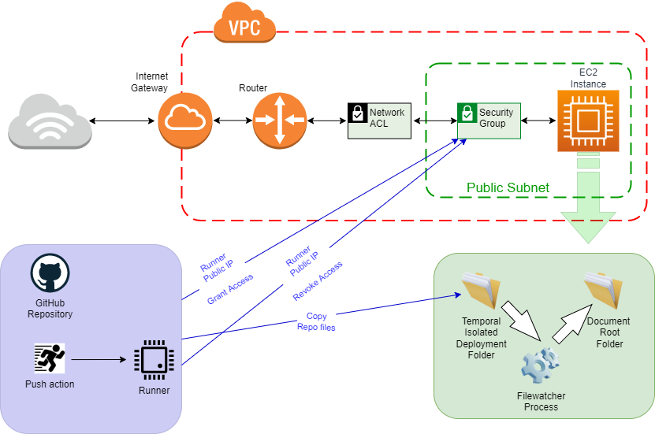

En la última entrada comentaba lo que Github nos permite hacer con sus actions, podéis leerlo aquí [Github Actions](https://pruebadeconcepto.es/github-actions/)

Hoy os traigo un caso de uso práctico y real para estas actions, que días atrás nos surgió cuando queríamos subir a una máquia EC2 un fichero que se genera y almacena en nuestro repositorio en Github, de manera que cuando ese proceso/action de publicación terminase, ante el evento push en el repo se enviase al servidor EC2.

El diagrama más o menos sería esto:



Ante el evento push del fichero (a parte de las acciones de SAST, auditorías, etc) se va a levantar un runner el cual realizará los siguientes pasos:

1.- Instala y configura [AWS Cli](https://aws.amazon.com/es/cli/) Para esto emplea los secretos que contienen los valores para Access Key y Secret Access Key de una [identidad IAM](https://docs.aws.amazon.com/IAM/latest/UserGuide/id_credentials_access-keys.html) creada con el fin de poder habilitar y revokar únicamente accesos en el security group de la instancia EC2. En el [repositorio github](https://github.com/antoniohernan/putfiles2ec2#prerequisites) podéis ver un ejemplo de la política necesaria para realizar estas labores.

2.- Obtiene la dirección publica del runner Cada vez que se ejecute la action será en una máquina distinta dentro del pool de máquinas que pueda tener Github.com, y se presentará a internet con una Ip diferente. Con este sencillo comando sacamos la dirección pública de la máquina runner con la que llegaremos a nuestra instancia EC2

`wget -qO- https://ipecho.net/plain`

El valor obtenido lo pasamos a una variable de entorno para poder utilizarlo más adelante.

3.- Autorizamos el acceso por el puerto ssh tcp/22 en nuestra instancia EC2 Puesto que la copia del fichero desde nuestro repositorio será por scp debemos poder llegar a la máquina desde el runner (que no tiene ip fija pero ya tenemos su ip púiblica en el paso anterior) y para esto tenemos que permitir el tráfico en el security group de esa instancia, que de otra manera está por defecto no permitido.
```
aws ec2 authorize-security-group-ingress --group-id "${{ secrets.AWS_SGWEB }}" --protocol tcp --port "${{ secrets.AWS_VMPORT }}" --cidr "${{ env.IP_RUNNER }}/32"
```

4.- Preparamos el runner Para poder lanzar la conexión scp hacia nuestra instancia EC2 debemos tener la clave ssh en el runner, y configurarla donde corresponde, y todo de manera que no quede rastro en los logs de actividad de la action, así que recurrimos a los secrets de las actions para que aparezca en el log como  "***". El código es este, creamos los directorios necesarios, permisos en directorios y ficheros y volcamos el pem.
```
config_ssh=~/.ssh/config
keyfile=~/.ssh/Key.pem
mkdir ~/.ssh && echo -e "ExitOnForwardFailure=yes\\nStrictHostKeyChecking=no" > ${config_ssh} && chmod 600 ${config_ssh}
echo "${AWSKEY}" > ${keyfile} && chmod 600 ${keyfile}
```

5.- Descargamos el repositorio sobre el runner Con esta action (estamos usando la action de checkout propia de github) descargamos en el runner el contenido de nuestro repo, de manera que tendremos el fichero/os a copiar sobre nuestra instancia EC2. Es como hacer un git clone reponame de toda la vida
```
uses: actions/checkout@93ea575cb5d8a053eaa0ac8fa3b40d7e05a33cc8
```

6.- Copiamos los ficheros de local (runner, repo clonado) hacia la instancia EC2 Un simple scp recursivo hacia un directorio de despliegues, con un usuario en el servidor no privilegiado. Todos los datos que no queramos que se pinten en los logs es mejor pasarlos como secretos, ya que así sólo veremos "***" en el log.
```
scp -r -i ${keyfile} $GITHUB_WORKSPACE/data/* ${AWSVMUSERNAME}@${AWSVMFQDN}:/${AWSDESTINATION} 2>/dev/null
```
7.- Y por último, si o si, sea cual sea el resultado, cerramos el security group Y así cerramos el acceso del runner evitando dejar accesos permitidos que con el tiempo pueden ser difíciles de manejar. La clave de este paso es ese `if: always()`que hará que se ejecute siempre sea cual sea el estado de los pasos anteriores de nuestra action.
```
if: always()
run: aws ec2 revoke-security-group-ingress --group-id "${{ secrets.AWS_SGWEB }}" --protocol tcp --port "${{ secrets.AWS_VMPORT }}" --cidr "${{ env.IP_RUNNER }}/32"
```
Hasta aquí sería la parte github, pero claro, el fichero/os se quedan en un directorio aislado, con un usuario no privilegiado y hay que moverlo de alguna manera a su ruta definitiva. En mi caso era moverlo al documentroot de un webserver, y empleé el siguiente script que se encarga de monitorizar la actividad sobre el directorio de deployments y mover los ficheros, cambios de usuarios/groups y permisos:

```
#!/usr/bin/env bash

user=www-data
group=www-data
origin=/Deployments
target=/var/www/<virtualhost_documentroot>/

# Check if another instance of script is running
[[ $(lsof -t $0| wc -l) > 1 ]] && echo "At least one of $0 is running" && exit

while true
do
  #Inotify Trigger
  inotifywait -r --exclude "(swp|swx)"  -e close_write -t 300 ${origin}
  cp -pr ${origin}/* ${target}
  chown -R ${user}:${group} ${target}
  sleep 30
done
```

Espero os guste y os sea de utilidad.

Todo el código y documentación de esta entrada la encontráis en: [https://github.com/antoniohernan/putfiles2ec2](https://github.com/antoniohernan/putfiles2ec2)
