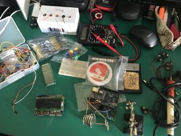
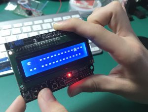
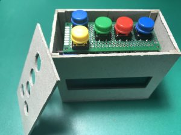

Mañana se cumple **un mes de confinamiento** forzoso, y durante todo este tiempo donde la convivencia en casa se intensifica hemos perdido la cuenta de la cantidad de cosas que se andan rompiendo.

Se han roto bastantes vasos, creo que platos aún no, un silla del salón (si... una silla...), algunas cosas que antes funcionaban que, por el uso intensivo, han dejado de hacerlo, y mejor no mencionar los dolores y algún que otro cardenal por empeñarnos en hacer físico en el salón, que da para lo que da.

En vista del incremento de desastres que estaban sucediendo, e influenciados por el Reloj de Guerra de Pacific Rim se nos ocurrió **jugar un poco con una Arduino** que teníamos por casa y un display.

Así tendríamos nuestro propio reloj de "Desastres" en casa (aunque he de reconocer que es algo que llevaba tiempo rondándome por la cabeza, hacer un reloj de "Contador de Días sin Marrones" para poner en el trabajo...)

La verdad es que **nunca había tomado muy en serio a Arduino**, tenía una placa de Arduino UNO (por supuesto de las réplicas chinas...) y algunos componentes comprados en masa, pero no le había dado muchas oportunidades.

Ha sido a raiz de hacer este proyecto con mi hijo cuando me he dado cuenta de que se trata de una plataforma realmente válidad para la enseñanza, lo tiene todo.

Te permite ver electrónica sin necesidad de tener grandes conocimientos, con la placa y una [breadboard](https://es.wikipedia.org/wiki/Placa_de_pruebas), cables y componentes varios puedes montar circuitos rápidamente y controlar desde la placa leds, sensores (luz, humedad, temperatura, etc.), servos y casi todo lo que te haya venido con el kit, impensable en otros tiempos.

Y en cuanto a programación de refiere, su IDE es muy claro, con un lenguaje lo suficientemente sencillo para rápidamente empezar a hacer cosas algo complejas.

Para enseñar a un chico que no ha tenido mucho contacto con la programación se muestra un lenguaje claro y en poco tiempo podrá definir constantes, declarar variables y entender los tipos más básicos, entender lo que es la función de Setup y que hacemos allí una única vez, y que es la función de Loop, las estructuras de control que podemos tener (if, else, switch, etc.), los operadores lógicos, incremento de variables y asignación de valores...

Y funciones propias, como la que usamos para controlar las pulsaciones en los botones de la Keypad Shield, detectando señales por los puertos analógicos.

Todo esto viendo de manera inmediata el cambio que ha hecho en la programación de la placa, con su display en las manos, **se refleja al momento en cuanto se compila y envia a la placa**.

Cuando utilizamos [una shield como esta](https://wiki.dfrobot.com/LCD_KeyPad_Shield_For_Arduino_SKU__DFR0009), que incorpora un display (de 16x2, esto es, 16 caracteres en cada línea, 2 líneas) y los botones necesarios, el potencial de esta sencilla placa aumenta una barbaridad, siendo el precio del conjunto de apenas 10€.

Incluso podremos hacer que cada una de las celdas a "pintar", de esa matriz de 16x2 se pueda rellenar como lo que es, una matriz de 5x8 que podemos [cargar como un mapa de bits](https://maxpromer.github.io/LCD-Character-Creator/), 0 led apagado y 1 led encendido.

Así que una vez que hemos trasteado con los componentes un buen rato y viendo que el proyecto del contador de desastres era viable nos pusimos al lío.

Aquí podréis encontrar toda la información relativa al proyecto:

[https://github.com/antoniohernan/cddf](https://github.com/antoniohernan/cddf)

Ya andamos dándole vueltas a la versión 2 del código, para quitar los contadores de meses, y dejar únicamente tres cifras de días, dejando una línea inferior algo más limpia.

También está la cuestión de la precisión, ahora mismo **acumula un retraso** de unos 10 minutos cada 24 horas, debido a que el delay de tiempo de 1 segundo (1000 ms) no tiene en cuenta el tiempo que se consume en la ejecución del propio código, de manera que siempre se tardará 1 segundo + unas cuantas milésimas que en 24 horas suman esos 10 minutos menos.

En estudio un par de alternativas, ya avisaremos de cual nos va mejor...

Y claro está, estos proyectos evidencian **nuestra necesidad imperiosa de tener una impresora 3D** cuanto antes, para no andar construyendo cajas para arduino hechas de cartón, que mal no nos quedan pero... como que no es lo mismo.

#NosotrosNosQuedamosEnCasa
