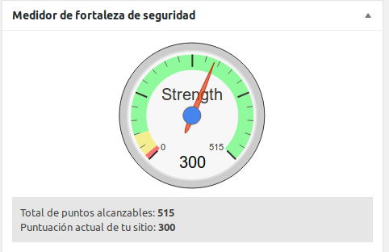
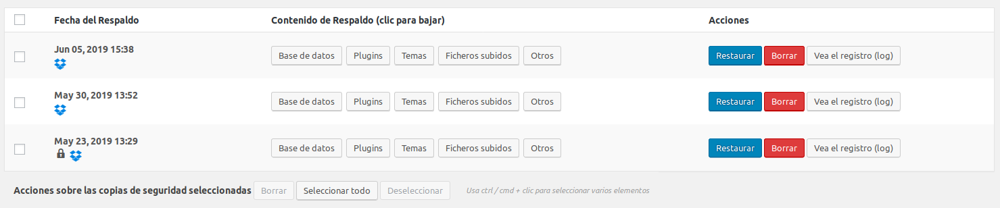

Consultando las **estadísticas de este modesto site veo** que el tráfico llega desde los lugares más **insospechados**, para un blog que está completamente en Castellano (Croacia, EEUU, Serbia, India, Bulgaria, China, Bangladesh.... y en 10ª posición España!!!)

Obvio, **el mundo está plagado de bots que andan buscando cualquier resquicio** por el que poder obtener información más o menos sensible, poder vulnerar el site o simplemente romperlo.

No había pensado en hacer ningún tipo de **restricción en el servidor web**, pero va a ser mejor tomar algunas medidas preventivas, e**n el fondo esto es como ponerle el candado a tu moto** o no, si se la quieren llevar se la van a llevar con el mejor candado del mundo, pero si al lado de la tuya hay otra que no tiene puesto nada, esa otra moto tiene más papeletas de que sea la que se lleven.

Vamos por tanto a poner unos "candados" al site.

Empezamos por **cortar las peticiones que vengan desde la [red Tor](https://www.torproject.org/)**. No es que tenga nada en contra de esta red y soy usuario habitual **cuando quiero navegar bajo anonimato**, pero también conozco todo lo que se puede llegar a hacer bajo ese anonimato y a este blog no le aporta nada, por tanto lo cerramos.

Se deniega el servicio de páginas por configuración de Apache a las ips de este red, pero ¿**cuales son esas Ips**?, cambian constantemente. Hay varios sitios de donde podemos sacarlas, el que más me gusta es **dan.me.uk**, el único problema que podéis tener con **este servicio es que no os va a dejar descargar el fichero más que una vez cada hora** (media hora parecer ser que ahora lo han bajado), creo que suficiente.

Descargamos el fichero programado con crontab sobre la ruta de configuración de apache, cada hora, construyendo el fichero de exclusión en la misma línea.
```
@hourly wget -q https://www.dan.me.uk/torlist/ -O - | sed "s/^/Require not ip /g; 1i\<RequireAll\>\nRequire all granted" | sed '$a\<\/RequireAll\>' > /etc/apache2/tor-ip.txt
```
Y realizamos la siguiente configuración sobre el virtual host de nuestro site:
```
<Directory /var/www/>
 Options Indexes FollowSymLinks
 AllowOverride None
 Require all granted
 Include /etc/apache2/tor-ip.txt
</Directory>
```
Si todo funciona **dejamos el crontab de descarga y procesado de la lista tor enlazado** con el reinicio de Apache para que se tomen los cambios del listado de Ips
```
@hourly wget -q https://www.dan.me.uk/torlist/ -O - | sed "s/^/Require not ip /g; 1i\<RequireAll\>\nRequire all granted" | sed '$a\<\/RequireAll\>' > /etc/apache2/tor-ip.txt; /usr/sbin/apachectl graceful
```
Ahora vamos a **restringir las peticiones a los Bots, los Bad Bots**, seguimos los pasos del proyecto [bad bot blocker](https://github.com/mitchellkrogza/apache-ultimate-bad-bot-blocker)

```
root@ip-172-31-22-120:~# sudo mkdir -p /etc/apache2/custom.d
root@ip-172-31-22-120:~# sudo wget https://raw.githubusercontent.com/mitchellkrogza/apache-ultimate-bad-bot-blocker/master/Apache_2.4/custom.d/globalblacklist.conf -O /etc/apache2/custom.d/globalblacklist.conf
--2019-06-05 12:08:20-- https://raw.githubusercontent.com/mitchellkrogza/apache-ultimate-bad-bot-blocker/master/Apache_2.4/custom.d/globalblacklist.conf
Resolving raw.githubusercontent.com (raw.githubusercontent.com)... 151.101.60.133
Connecting to raw.githubusercontent.com (raw.githubusercontent.com)|151.101.60.133|:443... connected.
HTTP request sent, awaiting response... 200 OK
Length: 400140 (391K) [text/plain]
Saving to: ‘/etc/apache2/custom.d/globalblacklist.conf’

/etc/apache2/custom.d/globalblacklist.conf 100%\[=====================================================================================================>] 390.76K --.-KB/s in 0.05s

2019-06-05 12:08:21 (7.72 MB/s) - ‘/etc/apache2/custom.d/globalblacklist.conf’ saved [400140/400140]
```
Generamos nuestra configuración de **lista blanca de ips y dominios**:
```
root@ip-172-31-22-120:~# sudo wget https://raw.githubusercontent.com/mitchellkrogza/apache-ultimate-bad-bot-blocker/master/Apache_2.4/custom.d/whitelist-ips.conf -O /etc/apache2/custom.d/whitelist-ips.conf
--2019-06-05 12:09:11-- https://raw.githubusercontent.com/mitchellkrogza/apache-ultimate-bad-bot-blocker/master/Apache_2.4/custom.d/whitelist-ips.conf
Resolving raw.githubusercontent.com (raw.githubusercontent.com)... 151.101.60.133
Connecting to raw.githubusercontent.com (raw.githubusercontent.com)|151.101.60.133|:443... connected.
HTTP request sent, awaiting response... 200 OK
Length: 1268 (1.2K) [text/plain]
Saving to: ‘/etc/apache2/custom.d/whitelist-ips.conf’

/etc/apache2/custom.d/whitelist-ips.conf 100%\[=====================================================================================================>] 1.24K --.-KB/s in 0s

2019-06-05 12:09:11 (179 MB/s) - ‘/etc/apache2/custom.d/whitelist-ips.conf’ saved [1268/1268]

root@ip-172-31-22-120:~# sudo wget https://raw.githubusercontent.com/mitchellkrogza/apache-ultimate-bad-bot-blocker/master/Apache_2.4/custom.d/whitelist-domains.conf -O /etc/apache2/custom.d/whitelist-domains.conf
--2019-06-05 12:09:18-- https://raw.githubusercontent.com/mitchellkrogza/apache-ultimate-bad-bot-blocker/master/Apache_2.4/custom.d/whitelist-domains.conf
Resolving raw.githubusercontent.com (raw.githubusercontent.com)... 151.101.16.133
Connecting to raw.githubusercontent.com (raw.githubusercontent.com)|151.101.16.133|:443... connected.
HTTP request sent, awaiting response... 200 OK
Length: 1714 (1.7K) [text/plain]
Saving to: ‘/etc/apache2/custom.d/whitelist-domains.conf’

/etc/apache2/custom.d/whitelist-domains.conf 100%\[=====================================================================================================>] 1.67K --.-KB/s in 0s

2019-06-05 12:09:18 (229 MB/s) - ‘/etc/apache2/custom.d/whitelist-domains.conf’ saved [1714/1714]
```
En el fichero **whitelist-ips.conf** ponemos las **ips que queremos excluir del bloqueo**, y en el fichero **whitelist-domains.conf** ponemos **los dominios que queremos excluir**. Para editarlos, por supuesto, usamos [Vi](http://ex-vi.sourceforge.net/).

Ejemplo de como quedaría la lista blanda de dominios:
```
SetEnvIfNoCase Referer ~*pruebadeconcepto\.nsupdate\.info good_ref
```
(* _notamental_... hacer un "chuletas" sobre Vi, que **últimamente me usáis mucho Nano y me jode sobremanera**..)

Ahora bajamos la configuración de la **lista negra de bloqueo de Ips**, que podremos igualmente editar para añadir las que queramos (ojo si actualizamos que se pierden nuestros cambios...)
```
sudo wget https://raw.githubusercontent.com/mitchellkrogza/apache-ultimate-bad-bot-blocker/master/Apache_2.4/custom.d/blacklist-ips.conf -O /etc/apache2/custom.d/blacklist-ips.conf
```
Seguimos, la **lista de referer de dudosa reputación**:
```
sudo wget https://raw.githubusercontent.com/mitchellkrogza/apache-ultimate-bad-bot-blocker/master/Apache_2.4/custom.d/bad-referrer-words.conf -O /etc/apache2/custom.d/bad-referrer-words.conf
```
Ya casi estamos, **la lista de user agents a bloquear**:
```
sudo wget https://raw.githubusercontent.com/mitchellkrogza/apache-ultimate-bad-bot-blocker/master/Apache_2.4/custom.d/blacklist-user-agents.conf -O /etc/apache2/custom.d/blacklist-user-agents.conf
```
Para terminar **sólo nos quedan dos cosas por hacer**, **activar la configuración en Apache**, editando el fichero apache2.conf:
```
<Directory /var/www/>
Options Indexes FollowSymLinks
AllowOverride None
Require all granted
Include /etc/apache2/tor-ip.txt
Include custom.d/globalblacklist.conf
</Directory>
```
Reiniciamos Apache
```
root@ip-172-31-22-120:/etc/apache2# apachectl restart
```
Y **programar el proceso en crontab para el refresco de estos ficheros**, que más fácil no nos lo pueden poner..
```
root@ip-172-31-22-120:/etc/apache2# wget https://raw.githubusercontent.com/mitchellkrogza/apache-ultimate-bad-bot-blocker/master/update-apacheblocker.sh
--2019-06-05 12:48:15-- https://raw.githubusercontent.com/mitchellkrogza/apache-ultimate-bad-bot-blocker/master/update-apacheblocker.sh
Resolving raw.githubusercontent.com (raw.githubusercontent.com)... 151.101.60.133
Connecting to raw.githubusercontent.com (raw.githubusercontent.com)|151.101.60.133|:443... connected.
HTTP request sent, awaiting response... 200 OK
Length: 5342 (5.2K) [text/plain]
Saving to: ‘update-apacheblocker.sh’

update-apacheblocker.sh 100%\[=====================================================================================================>] 5.22K --.-KB/s in 0s
2019-06-05 12:48:15 (80.1 MB/s) - ‘update-apacheblocker.sh’ saved [5342/5342]
```
Modificamos en ese fichero, en las **variables de entorno nuestra dirección de correo, el protocolo del site (https), el nombre del dominio** y lo programamos así en crontab:
```
@daily /etc/apache2/update-apacheblocker.sh
```
No olvidarse de **darle permisos de ejecución**:
```
root@ip-172-31-22-120:/etc/apache2# chmod u+x update-apacheblocker.sh
```
**Más "candados" para poner, ahora un plugin de seguridad**, que en esto si que ha crecido Wordpress respecto a lo que fue años atrás.

He instalado y configurado el plugin [All In One WP Security](https://es.wordpress.org/plugins/all-in-one-wp-security-and-firewall/), es **todo muy sencillo**, ir entrando por las pestañas y habilitando todo aquello que queramos.



En caso de necesitar alguna **actuación sobre el servidor nos lo va a indicar**, instalar tal componente de php, cambiar algún permiso de fichero poco restrictivo, todo bastante fácil.

**Y un último candado, si todo falla el sitio se va a la porra, una buena copia de seguridad**.

Lo **ideal sería poder tener snapshot** del volumen de nuestra instancia, a diario, si algo cae se restaura el backup y en segundos estamos online otra vez, pero la capa gratuita solo nos deja creo recordar que 1Gb de espacio para este tipo de copias.

La solución es instalar u**n plugin de copias, que nos permita llevarnos todo nuestro Wordpress a un almacenamiento en nube**, esto es, nuestro Wordpress, la contribución (uploads) y la base de datos.

Yo estoy usando este [UpdraftPlus - Backup/Restore](https://es.wordpress.org/plugins/updraftplus/), y estoy volcando sobre una cuenta que tengo en dropbox con bastantes gigas libres (esto en su día con las invitaciones y un script en Perl.. fue **un filón de gigas**... da para una entrada en [informática viejuna](/pruebadeconcepto/infov/infv_guybrush/)).

Os **pedirá instalar algún componente de php, creo que curl** y poco más, la configuración sencilla, periodicidad de la copia, opciones, el destino (este es de los más completos, dropbox, s3, Swift, sftp, google drive, onedrive, etc) y la retención del backup.

En unos minutos la copia estará programada.



Espero no tener que usar estas copias nunca.
