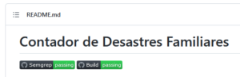
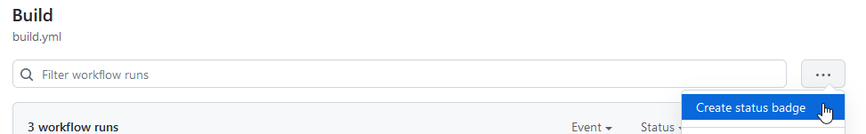

Hacía tiempo que tenía ganas de escribir algo de nuevo y vaya.. [actions](https://github.com/features/actions) se ha cruzado conmigo recientemente a nivel laboral donde lo hemos retorcido bastante con [Azure Sentinel](https://docs.microsoft.com/en-us/azure/sentinel/ci-cd?tabs=github) y sus despliegues de reglas analíticas, así que me he animado a poner un par de acciones en uno de mis repositorios de código en Github.com.

Los beneficios de usar [Github Actions](https://github.com/actions) en nuestgros repositorios son:

- Automatiza todo dentro del flujo de GitHub:

Las acciones te dan la posibilidad de implementar potentes automatizaciones directamente en tus repositorios. Puedes crear tus propias acciones o utilizar las que están disponibles en GitHub Marketplace para integrar tus herramientas preferidas en tu repositorio.

- Máquinas virtuales alojadas en múltiples sistemas operativos:

Las acciones ofrecen máquinas virtuales (VM) alojadas con Ubuntu Linux, Windows y macOS para que puedas construir, probar y desplegar el código directamente en el sistema operativo de tu elección, o en los tres al mismo tiempo.

- Plantillas de integración continua preescritas y listas para usar:

GitHub Actions lleva la integración continua (CI) directamente al flujo de GitHub con plantillas construidas por desarrolladores para desarrolladores. También puedes crear tus propios flujos de trabajo de IC personalizados, y tus propios flujos de trabajo de despliegue continuo (CD).

- Pruebas sencillas de contenedores y sistemas operativos:

Gracias a la compatibilidad con Docker y al acceso a instancias alojadas de Ubuntu Linux, Windows y macOS, Actions simplifica la creación y la prueba de código en todos los sistemas, así como la automatización de los flujos de trabajo de creación y prueba.

- Utilízalo en tu repositorio público de forma gratuita:

GitHub Actions es de **uso gratuito en todos los repositorios públicos y se puede utilizar de forma gratuita en los repositorios privados con un límite de 2.000 minutos al mes** de flujos de trabajo alojados (o una cantidad ilimitada de minutos si un desarrollador aloja su propio servidor de GitHub Action).

Traduciendo esto a los menos versados, podemos hacer infinidad de operaciones para las que antes empleábamos si o si un servidor con Jenkins directamente en nuestro repositorio, teniendo además el código fuente de estas acciones en el propio repositorio, pues la contribución de estas acciones se hace en formato Yamel y los ficheros se alojan bajo `.github/workflows`

Para esta prueba de concepto he pensado generar dos acciones, ambas que se ejecuten al hacer un push de un fichero sobre cualquier rama (o al hacer el merge de una Pull Request que genera un push sobre la rama `main/master`).

En **primer lugar** vamos a realizar una acción de análisis de código estático o **SAST (**Static application security testing**)**

Las SAST son un conjunto de tecnologías diseñadas para analizar el código fuente, el código de bytes y los binarios de las aplicaciones en busca de condiciones de codificación y diseño que sean indicativas de vulnerabilidades de seguridad. Las soluciones SAST analizan una aplicación desde "dentro hacia fuera" en un estado de no ejecución.

Vamos a buscar básicamente secretos y problemas de auditoria en el código, por si nos hemos despistado y hemos colgado públicamente alguna credencial.

 

En **segundo lugar** vamos a realizar una **build** o construcción del código que se contribuye al repositorio, por si existe algún problema de compilación que no hayamos detectado, sintaxis, dependencia de librerías, etc .

## SAST

Generamos el fichero `.github/workflows/semgrep.yml`
```
name: Semgrep

# Github Actions sintaxis help:
# https://docs.github.com/en/actions/using-workflows/workflow-syntax-for-github-actions

# Semgrep CI docs
# https://semgrep.dev/docs/semgrep-ci/overview/

on:
  # Scan changed files in PRs, block on new issues only (existing issues ignored)
  # All Branches
  pull_request: {}

  # Scan all files on branches, block on any issues
  # All Branches
  push:
  #   branches: ["develop", "main"]

  # Schedule this job to run at a certain time, using cron syntax
  # Note that * is a special character in YAML so you have to quote this string
  # schedule:
  #   - cron: '30 0 1,15 * *' # scheduled for 00:30 UTC on both the 1st and 15th of the month

jobs:
  semgrep:
    name: Scan
    runs-on: ubuntu-latest
    container:
      image: returntocorp/semgrep
    # Skip any PR created by dependabot to avoid permission issues
    if: (github.actor != 'dependabot[bot]')
    steps:
      # Fetch project source
      - uses: actions/checkout@v3

      - run: semgrep ci
        env:
          # Semgrep Rules
          # https://github.com/returntocorp/semgrep-rules
          SEMGREP\_RULES: >-
            p/security-audit
            p/secrets
```
Aquí le indicamos a Actions que ejecute esta acción al hacer cualquier pull_request, o al hacer push sobre cualquier rama (las posibles ramas sobre las que afinar el alcance de la acción están comentadas). También están comentadas las líneas de la posible programación de la acción, ya que podemos ejecutar la acción si lo queremos también como un "contrab" al uso, sin necesidad de que sea un evento concreto de nuestro repositorio el que ejecute el disparador.

El funcionamiento es sencillo, indicamos en que sistema operativo correrá el "runner" que ejecuta las acciones y luego las acciones a realizar, haciendo en primer lugar un checkout del nuestro código en ese runner para que se puedan aplicar las siguientes acciones, en este caso son la evaluación de esas reglas.

Ante los eventos indicados el job se ejecutará y podremos verlo en la parte de "Actions" de nuestro github.com

```
Run semgrep ci
Running `semgrep ci` without API token but with configs ('p/security-audit', 'p/secrets')
Scan environment:
  versions    - semgrep 0.93.0 on python 3.10.4
  environment - running in environment github-actions, triggering event is push

Fetching configuration from semgrep.dev
Fetching rules from https://semgrep.dev/registry.
Scanning 12 files with 43 <multilang> rules.

Some files were skipped or only partially analyzed.
  Scan was limited to files tracked by git.
  Scan skipped: 4 files larger than 1.0 MB, 1 files matching .semgrepignore patterns
  For a full list of skipped files, run semgrep with the --verbose flag.

(need more rules? `semgrep login` for additional free Semgrep Registry rules)
Ran 294 rules on 6 files: 0 findings.
Ran 294 blocking rules, 0 audit rules, and 0 internal rules used for rule recommendations.
Found 0 findings from blocking rules and 0 findings from non-blocking rules
No findings so exiting with code 0
```
Estamos utilizando [Semgrep](https://semgrep.dev/) , que es una evolución de pfff, que comenzó en Facebook en 2009, que a su vez era una evolución de la herramienta de refactorización de Linux Coccinelle. r2c revitalizó el proyecto después de que su autor original, Yoann Padioleau, se uniera a la empresa.

Podríamos emplear también [CodeQL](https://codeql.github.com/) que es de la propia Github, pero este software si que tiene coste ya que requiere que al menos se tenga una organización donde esté activo para poder ejecuarlo.

## BUILD

Para esta acción lo que vamos es a utilizar un runner que nos permita invocar a arduino-cli con el comando compile y con las librerías que empleamos en este proyecto y ver si se produce una compilación exitosa o no.

En el caso de tener una máquina virtual o un entorno de desarrollo lo que tendríamos que hacer para generar esa compilación es:
```
# Install arduino-cli
curl -fsSL https://raw.githubusercontent.com/arduino/arduino-cli/master/install.sh | sh
Installing in /home/ahernan/bin
ARCH=64bit
OS=Linux
Using curl as download tool
Downloading https://downloads.arduino.cc/arduino-cli/arduino-cli_0.22.0_Linux_64bit.tar.gz
arduino-cli  Version: 0.22.0 Commit: 65f662a7 Date: 2022-05-06T11:09:35Z installed 

# Install boards
arduino-cli core install arduino:avr
Installing platform arduino:avr@1.8.5...
Configuring platform....
Platform arduino:avr@1.8.5 installed

# Install Libraries
arduino-cli lib install LiquidCrystal

Downloading LiquidCrystal@1.0.7...
LiquidCrystal@1.0.7 downloaded
Installing LiquidCrystal@1.0.7...
Installed LiquidCrystal@1.0.7

# Compile
arduino-cli compile -b arduino:avr:uno ./cddf.ino
Sketch uses 5096 bytes (15%) of program storage space. Maximum is 32256 bytes.
Global variables use 295 bytes (14%) of dynamic memory, leaving 1753 bytes for local variables. Maximum is 2048 bytes.
```
Para nuestra acción este es el código `.yml` que ejecutaremos:
```
name: Build
on: 
  push:
    paths:
    - '**.ino'
    - '**build.yml' 
jobs:
  build:
    name: Compile
    runs-on: ubuntu-latest
    steps:
    - name: Checkout
      uses: actions/checkout@v3

    - name: Compile all files
      uses: ArminJo/arduino-test-compile@v3
      with:
        arduino-board\_fqbn: arduino:avr:uno
        required-libraries: LiquidCrystal
```
Indicamos los mismos parámetros que antes, la placa con -b ahora es un parámetro del proceso arduino-board_fqbn, y la librería que el cliente tradicional requiere que se instale se pasa a la acción como parámetro para que sea descargada.

La salida de la ejecución de esta acción sería:

```
arduino-cli downloading: ✓
Upacking arduino-cli to /home/runner/arduino_ide:  ✓
arduino-cli  Version: 0.22.0 Commit: 65f662a7 Date: 2022-05-06T11:09:35Z

Update index and install the required board platform
PLATFORM=arduino:avr
arduino-cli core update-index   > /dev/null
arduino-cli core install arduino:avr   > /dev/null

Special esp8266 and esp32 platform handling

List installed boards with their FQBN
arduino-cli board listall
Board Name                       FQBN                           
Adafruit Circuit Playground      arduino:avr:circuitplay32u4cat 
Arduino BT                       arduino:avr:bt  
...

Install required libraries
Install libraries LiquidCrystal

Compiling sketches / examples for board arduino:avr:uno

Creating directory /home/runner/cddf and copy ./* to it
Compiling cddf ✓
arduino-cli compile --verbose --warnings all --fqbn arduino:avr:uno   /home/runner/cddf
```

Por último, podemos colocar en nuestro README.md un testigo o badge de la ejecución de nuestras actions, de manera que veamos de una forma muy visual si está todo correcto:



Para esto vamos a cada una de nuestras acciones y pulsamos sobre el botón de los tres puntos **...**



Elegimos si quieremos afinar el alcance del badge (por rama, por evento, etc) y copiamos la url al portapales y la pegamos tal cual en nuestro readme.md y listo, ya tendremos el estado de las acciones.

[](https://github.com/antoniohernan/cddf/actions/workflows/semgrep.yml) [](https://github.com/antoniohernan/cddf/actions/workflows/build.yml)
