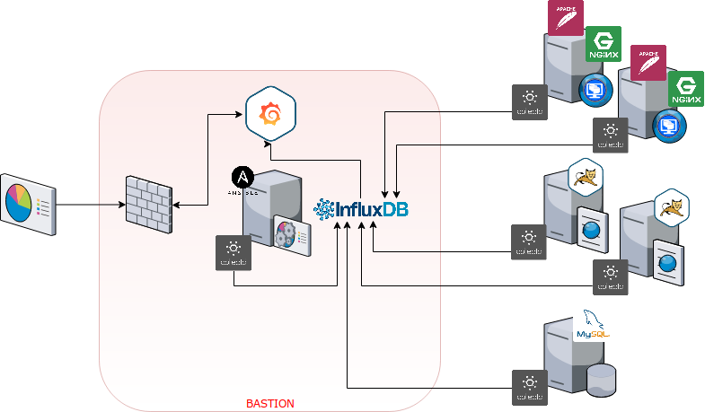
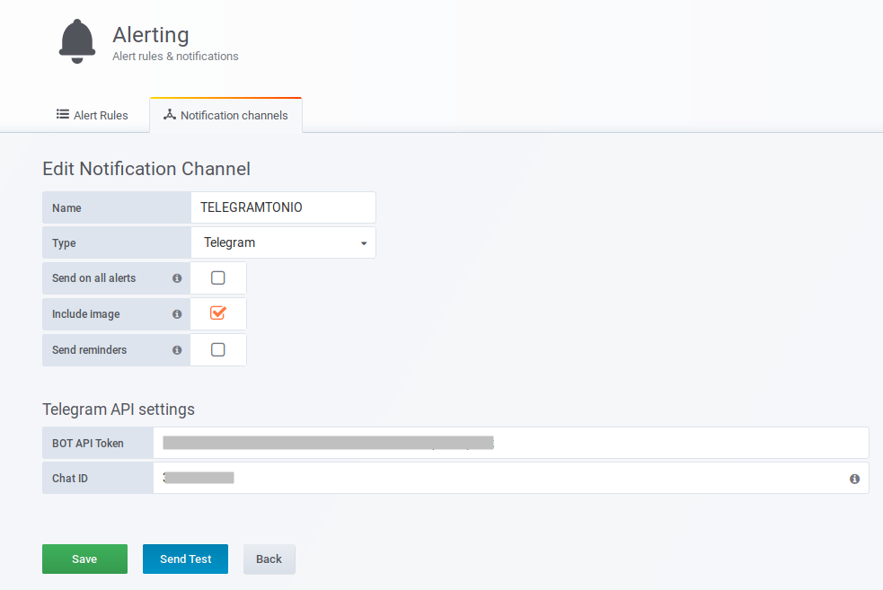

Vamos a recuperar un poco la esencia del blog, y hoy os traigo **una nueva prueba de concepto**.

Me ha sucedido en múltiples ocasiones, el cliente quiere **un proyecto en su mínima expresión**, instalar máquinas, instalar productos, echarlo todo a correr y luego un soporte mínimo o incluso ningún soporte. Esto funciona bien hasta **el día que se rompe todo o una parte y piden explicaciones**.

Aquí han sido **miles las horas que siempre he perdido**, revisión de logs, cruzar estos con otras máquinas para ver si esto afecta a aquello, puntos de fallo, puntos de mejora, responder a preguntas tipo "_y esto por qué no lo hemos visto antes?_" y así podría estar horas.

Con la llegada de las "nubes" esto iba a estar chupado, despliego en AWS la infraestructura y activo CloudWatch, ya está, **tengo métricas y tengo alarmas**.

Pues no, porque el cliente no siempre quiere pagarlo, o tengo clientes en distintas nubes, cada uno con sus métricas y sus servicios de monitorización y/o alarmado, así que empieza el caos.

La solución que adopté fue emplear **un colector único de métricas para todas las máquinas**, [CollectD](https://collectd.org/), que nos permite recoger aquellos **parámetros básicos del servidor** esté donde esté desplegado, o datos algo **más avanzados** por configuración de **plugins** (bases de datos, estados de JVMs, etc) o incluso algunos **datos realmente personalizados** que no solo nos enviarán métricas si no que podrán incluso ejecutar operaciones más complejas para solventar problemas a la vez que notifica (para esto.. la máquina es David [https://twitter.com/Shefirot88](https://twitter.com/Shefirot88) a.k.a. el "_externo_")

Todos estos datos se recogen en una **base de datos de series**, la elegida es [InfluxDB](https://www.influxdata.com/products/influxdb-overview/), la cual expone su puerto al mundo y que deberemos por tanto controlar con alguna solución de Firewall, Security Groups si es que estamos en AWS, etc.

Y por último, **para explotar esa información** emplearemos [Grafana](https://grafana.com/grafana/) y alguno de los muchos [dashboards genéricos](https://github.com/antoniohernan/deploy_monitor/blob/master/NOTES.txt) que tiene por la comunidad hasta que nos hagamos los nuestros propios.

La infraestructura sería algo así:

 

El proceso de instalación es muy sencillo, [**como explico en mi git**](https://github.com/antoniohernan/deploy_monitor/blob/master/README.md), basta con tener el inventario bien informado y la conectividad resuelta para poder ejecutar el playbook de instalación.

Esta POC está viva y no descarto que **un día consiga tiempo libre** como para poder acometer todo lo [pendiente](https://github.com/antoniohernan/deploy_monitor/blob/master/TODO.txt).

Y os preguntaréis por **donde están las alarmas**, pues sencillo, en **Grafana**, en la configuración de canales de notificación. Este canal para notificar usando Telegram es uno de los que más me gusta y mejor funciona, llegando incluso a adjuntar en el mensaje una captura del estado del panel que ha generado la alarma, realmente bueno.

Y posteriormente, en cada panel, **en la zona de Alarmas, podremos emplear este canal de notificación** para que se generen las notificaciones según se disparen los eventos (por umbral de disco, cpu, memoria, métricas personalizadas, etc. ).

 

En la parte inferior  hay dos valores un tanto peculiares.

Se refieren a **si se generaran alarmas cuando no se encuentren datos** en la base de datos de series para este panel, o bien tenemos un timeout con la base de datos de métricas. Pueden ser muy útiles ya que una ausencia de datos puede significar algo importante, por ejemplo, un "hueco" en la recepción de datos de un punto de montaje en NFS nos puede indicar que el servicio de NFS se ha podido caer.. y así con muchas más cosas. Aunque también es verdad que la mayoría de las alarmas que se generen por esta falta de datos serán, casi en su totalidad, falsos positivos ocasionados por la perdida de conexión entre Grafana e InfluxDB.

Y con esto ya está, rápido, sencillo y eficaz; Multicloud y multicliente, el que no lo tiene todo monitorizado es por que no quiera.
